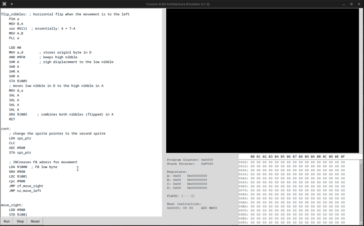

# 8-bit CPU Emulator

A custom 8-bit CPU architecture and emulator built in Python. A hands-on implementation of instruction set design, memory-mapped I/O, and low-level execution logic.

<p align="center">
  
</p>

*Emulated execution at 1 MHz clock*

---

## Overview

This emulator implements a fully custom 8-bit instruction set architecture (ISA).

* **Architecture:** Register-based execution model.
* **Instruction Set:** Custom 8-bit opcode format (**AAA BBB CC**).
* **Graphics:** Built-in framebuffer (memory-mapped, 256 × 160).
* **Full Toolchain:** Custom but familiar assembly language, integrated assembler, and disassembler.
* **Interface:** Tkinter-based GUI for real-time debugging.

## Project Structure

* `cpu.py`: CPU core & Memory bus.
* `assembler.py`: Two-pass assembler.
* `disassembler.py`: Generates a disassembly of next instruction.
* `timer.py`: Simple timer to generate IRQ/NMI signals.
* `ui.py`: Tkinter dashboard & Framebuffer.
* `main.py`: Application entry point.

---

## Architecture

### Registers & Flags

| Registers | Description | Flags | Description |
| :--- | :--- | :--- | :--- |
| **A** | Accumulator | **Z** | Zero flag |
| **B, C, D** | General-purpose | **N** | Negative flag |
| **DC** | 16-bit pointer (D:H, C:L) | **CF** | Carry flag |
| **PC / SP** | Program Counter / Stack | **V** | Overflow flag |

### Instruction Format: `AAA BBB CC`
* **AAA**: Operation (3 bits)
* **BBB**: Operand / Mode / Condition (3 bits)
* **CC**: Instruction Group (2 bits: 00=ALU, 01=LOAD/STORE, 10=Flow, 11=Special)

## Instruction Groups

### ALU (CC = 00)
Operations using **A** as accumulator: **ADC, SBB, AND, ORA, XOR, CMP, CPB, CPC**.

### LOAD / STORE (CC = 01)
**Addressing modes:**
* Immediate (`#value`), Absolute (`$ADDR`).
* Indexed (`$ADDR+B`, `$ADDR+C`).
* Indirect (`($ADDR)`) and Indirect Indexed (`($ADDR)+B`).
* Memory via DC pointer (`[DC]`, `[DC+B]`).

### FLOW CONTROL (CC = 10)
* **Instructions:** JMP, JSR, BRA, BSR, RET, RTI.
* **Conditions:** ZF, NZ, NF, NN, CF, NC, VF.

### SPECIAL (CC = 11)
**MOV, INC, DEC, NEG, CLR, PSH, PLL**, shifts/rotations, and flag control (CLC, SEC, etc.).

## Interrupt System
* **IRQ (maskable):** Vector `0xFFFC`. Controlled by I flag.
* **NMI (non-maskable):** Vector `0xFFFA`. Edge-triggered.
* **Mechanism:** Pushes PC (16-bit) and Flags to stack. Return via `RTI` instruction.

## Memory Map

| Range | Function |
| :--- | :--- |
| `0x0000 - 0x00FF` | System Reserved (Zero Page) |
| `0x0100 - 0x5FFF` | **User RAM & Program** (Stack grows down from $6000) |
| `0x6000 - 0xFFFF` | **Framebuffer** (256 × 160 px, 1bpp) |

---

## Example Program
```assembly
.org $0100
    CLI             ; Enable interrupts
    LDA #$90
    CLR B

LOOP:
    BRA LOOP        ; Idle loop

IRQ:
    STA $6000+B     ; Write to framebuffer
    INC B
    RTI

.org $FFFC
    .word IRQ       ; IRQ Vector

```

## Quick Start

1. **Clone the repository**
2. **Run:** `python main.py`
3. **Execution:** Write or paste assembly code in the editor and use **Run** or **Step** to execute.

## Project Status

*   **Core:** Complete
*   **Toolchain:** Complete (Assembler/Disassembler)
*   **UI/Visuals:** Complete
*   **Testing:** In progress

# Why this project exists

This project was developed as a personal challenge to understand how a CPU works from the foundations. It served as a practical exercise to better understand low-level programming and to improve my Python development skills by building a simple but functional emulator from scratch.

## Inspiration

The design draws inspiration from what I have read about classic 8-bit architectures, such as the **MOS 6502**, **Zilog Z80**, and **Intel 8080**. I decided to implement my own instruction set and encoding model for educational purposes, without compromising realism.

